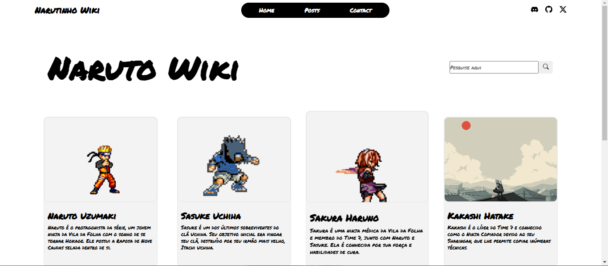
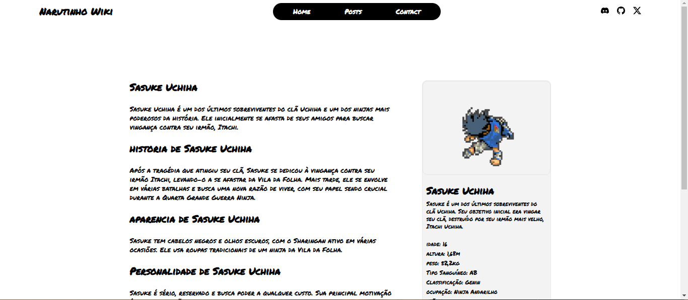
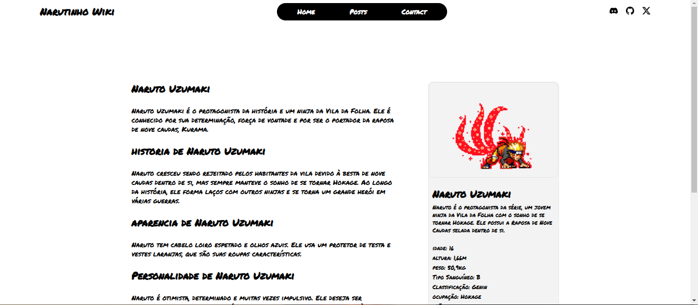
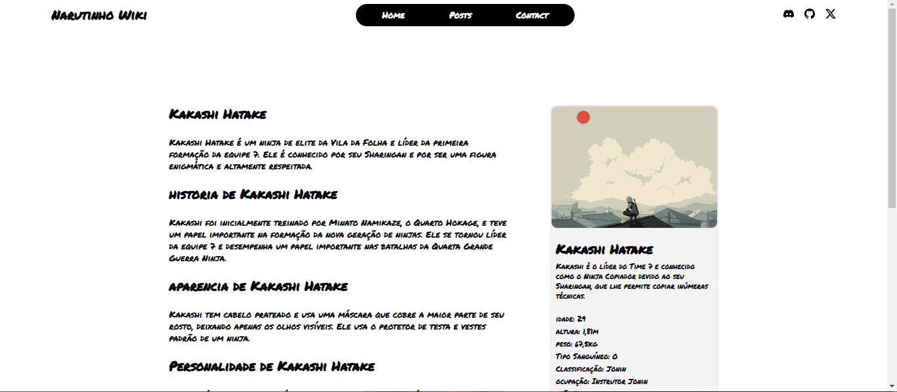
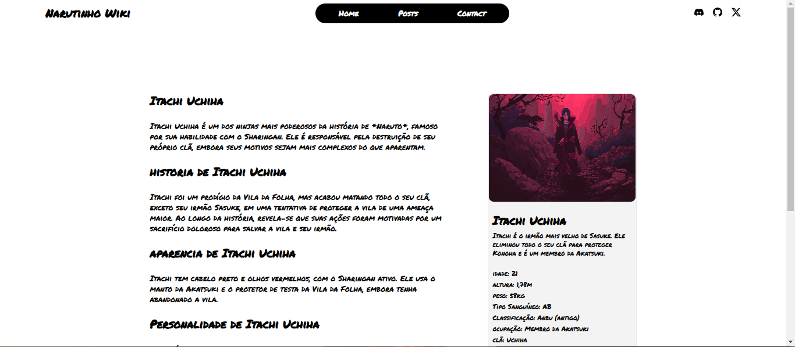

# Narutinho Wiki

**Narutinho Wiki** é uma wiki dos personagens de naruto.  

<br>

## 📸 Screenshots







<br>

## 🚀 Rodando localmente

Para rodar o projeto localmente, siga os passos abaixo:

Clone o repositório:
```bash
git clone https://github.com/Ranskyth/wiki-naruto-angular.git
```

Entre no diretório do projeto:
```bash
cd wiki-naruto-angular
```

Instale as dependências:
```bash
npm install
```

Inicie o servidor:
```bash
npm run start
```

<br>

## 🛠️ Stack utilizada

**Front-end:** Angular